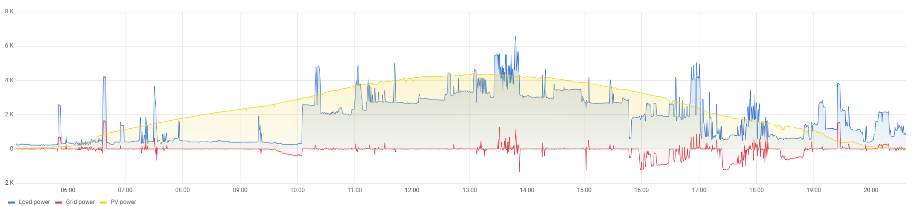
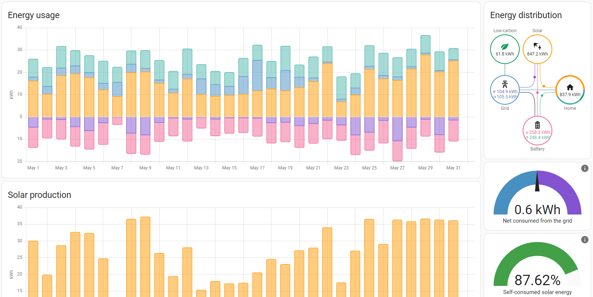
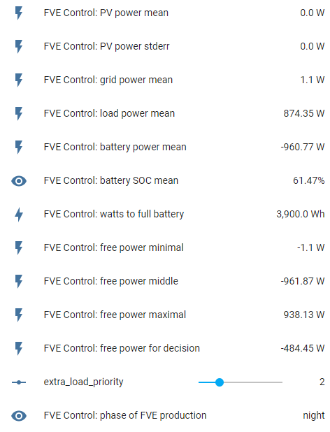
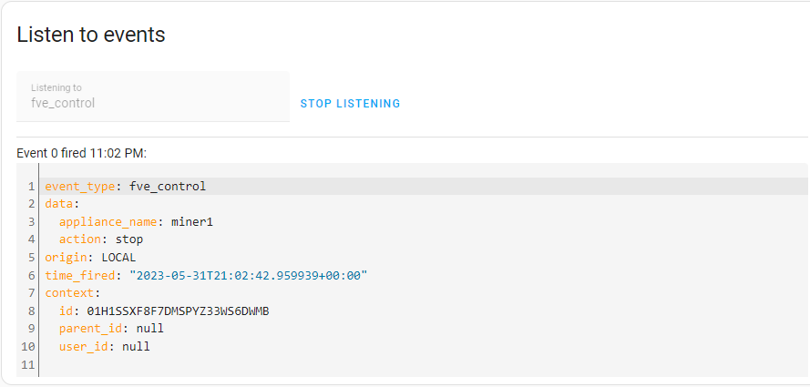

# FVE Load Control for Home Assistant

## Intro
Cílem projektu je eliminovat přetoky z domácích FVE pomocí automatického řízení spotřebičů.
Podívejme se na reálnou situaci ze https://solar-assistant.io. Žlutá je výkon FVE, modrá spotřeba domu, červená odběr / přetoky do sítě.


V 9:40 již svítilo tolik, že začánaly přetoky. Spotřeba domu byla cca. 266W. Automatika spustila v 10.00 dobíjení auta (cca. 2200W navíc). Následně zvyšovala výkon autonabíječky až na 3200W. Odpoledne postupně výkon snižovala. v 15:48 se již auto nabilo a současně byla plná baterie FVE. Automatika spustika cryptominer se spotřebou cca. 1500W, který běžel do cca. 1700W, kdy už klesl výkon a současně vzrostla spotřeba.

Pokud by k tomuto nedocházelo bude spotřeba vypadat stále jako cca. 200 - 300W. Někdy kolem 11.00 by se plně nabila baterie a zbytek dne by se vše vyváželo do sítě.

Díky této automatizaci se mi daří dlouhodobě držet velmi vysoký podíl doma spotřebované FVE. Kolem 90%.



Na základě cca. ročního hraní si jsem vyrobil tuto automatizaci. 

## Princip fungování

Princip je velmi jednoduchý. Automatiazace si na vstupu bere informace z FVE. Spotřebu, výkon panelů, nabití baterie, nákup / prodej do sítě. Na základě těchto dat si v každý okamžik počítá kolik je energie k dispozici. Postup je jednoduchý:
Všechny veličiny si zprůměruje za posledních 10minut abyhcom se vyhli unáhlené reakci na výkyvy způsobené např. mraky apod.

Následně si spořítá **kolik je výkonu navíc**. K tomu používá tři strategie:
1) **Minimální** je prostě rovne přetokům. Tedy pokud do sítě teče 500W, snaží se najít zdroj právě s touto energií a zapnout jej.
2) **Střední** je rovna přetokům + proudu do baterie. Tedy hodnotě, kdy by se vyrovnaly přetoky a současně by se zastavilo nabíjení baterie. To má reálně smysl například ráno, když slunce stoupá a očekáváme jasno. Spustí se zátěž, nabíjení baterie se na chvíli zastaví či zpomalí a pak zase postupně nabíhá.
3) **Maximální** přičte navíc ještě maximimální vybíjecí proud baterie (pokud není na nule). Tedy celková energie navíc je rovna hodnotě, kdy se baterie začne vybíjet, ale ještě nezačne nákup z gridu. Použití tohoto je pochopitelně rizikové.

Pokud detekujeme výkon navíc, postupně se dle priority pokouší zapnout spotřebiče dokud se hodnota extra výkonu  nesníží tak, že žádný zdroj nejde spustit.

Příklad:
Máme jen jeden zdroj a to patronu v bojleru s výkonem 2kW.
Panely dávají 2500W, ale postupně se nabíjí baterie výkonem 2kW.  
Spotřeba domu je 100W. Takže máme 400W přetoky.

S **minimální** strategií systém počká do nabití baterie. Dokud se nabíjí je výkon navíc jen 400W. A nejmenší dostupný spotřebič má 2kW. Takže nic.
Najednou se baterie nabije na 100%. V systému tedy máme najenou volných 2400W, které jdou do přetoků. Systém pouští ohřev a volný výkon klesá na 400W. Není k dispozici žádný další spotřebiče menší než 400W, takže se nic neděje.

Se **střední** strategií systém systém vidí jako volný vákon 2kW do baterie a těch 400W přetoků. pouští patronu a tím klesá nabíjecí výkon baterie na 400W. Ta se nabíjí pomaleji, ale stále to jede.

Úplně stejně pracujeme pokud naopak výkon chybí. Tedy je spotřeba větší než výkon panelů.
I zde zde bereme několik možností:
- **minimální** je nákup z gridu + rozdíl mezi maximálním nabíjecím proudem baterie a aktuálním (pokud nejsme na 100%). Je to tedy hodnota, kterou kdyby se povedlo najít (vypnutím spotřebičů), tak se začne baterie nabíjet na maximální hodnotu.
- **střední** je nákup z gridu + aktuální vybíjení baterie. Pokud tuto hodnotu najdeme přestaneme nakupovat a baterie se nebude vybíjet. 
- **maximální** je v tomto případě jen nákup z gridu. Tedy hodnota, kdy se bude baterie vybíjet stejným tempem, ale přestaneme nakupovat. 

Pokud je v systému chybějící výkon, systém zkouší vypnout spotřebiče. Zde bere ohled na definovanou minimální dobu běhu, kterou lze definovat.

A to je vše. V budoucnu plánuji zohlednit předpověď výkonu a počasí a také stav nabití baterie. Tedy trochu jinak reagovat když je baterie prázdná apod. Mám k tomu mnoho připeraveno, ale zatím ve vývojové verzi. I ten výše popsaný jednoduchý systém docela dobře funguje.

Jen dodám, že integrace samotná spotřebiče nespouští. Jen posílá HomeAssistantu eventy, které je možné požít pro jejich spuštění automatizací nebo jinou reakci.

## Instalace
Instalace je nejlépo mocí HACS. Je nutné přidat toto REPO

## Konfigurace
Integrace nemá vlastní rozhraní je nutné editovat `configuration.yaml`
Zde je ukázka. Kamkoliv do souboru přidejte něco takovéhoto.
```
fve_control:
  fve_grid_power_sensor: sensor.grid_power
  fve_pv_power_sensor: sensor.pv_power
  fve_load_power_sensor: sensor.load_power
  fve_battery_power_sensor: sensor.battery_power
  fve_battery_soc_sensor: sensor.battery_state_of_charge

  fve_battery_capacity: 10000
  fve_battery_soc_min: 20
  fve_battery_soc_min: 1900
  fve_battery_max_power_out: 1900

  appliances:
    - name: wallbox
      type: wallbox
      max_power: 3650
      min_power: 1800
      step_power: 230
      power_sensor: sensor.wallbox_gen_2_10_0_30_9_power_estimated
      availability_sensor: sensor.wallbox_gen_2_10_0_30_9_state
      switch_sensor: switch.wallbox_gen_2_10_0_30_9_charging_switch
      static_priority: 50
      minimal_running_minutes: 30
      startup_time_minutes: 2

    - name: miner1
      type: constant_load
      min_power: 1500
      static_priority: 20
      minimal_running_minutes: 5
      availability_sensor: switch.lidl_plug_2
      switch_sensor: switch.lidl_plug_2
      startup_time_minutes: 5
```

První část definuje vstupy z FVE

| parametr | význam |
|----------| ---    |
|   fve_grid_power_sensor    |  entita home assistant ukazující aktuální odběr/přetoky ve Wattech. Pokud jsou přetoky je hodnota záporná jinak kladná  |
|   fve_pv_power_sensor    |  senzor aktuálního výkonu panelů. [W]   |
|   fve_load_power_sensor    |  senzor aktuální celkové spotřeby  [W]|
|   fve_battery_power_sensor    | senzor výkonu z / do baterie. Pokud se baterie nabíjí je hodnota kladná, pokud vybíjí je záporná   [W] |
|   fve_battery_soc_sensor    | procento nabití baterie. Celé číslo 0 až 100  |

Pokud používáte SolarAssistant je konfigurace přesně jako na příkladu. Pokud ne je možné vyrobit virtuální senzory, které jednotky přizpůsobí.

Další čístí je základní nastavení systému.

| parametr | povinný |význam |
|----------| --- |---    |
|fve_battery_capacity|ano| celková kapacita baterie we [Wh]|
|fve_battery_soc_min|ano| minimální prcento, kam se vybíjí (0 až 100)|
|fve_battery_max_power_in|ano| jaký je maximální výkon nabíjení baterie [W]|
|fve_battery_max_power_out|ano| jaký je maximální výkon vybíjení baterie [W]|
|treshold_power |ne| minimální hodnota, kdy systém zkouší něco vypínat nebo zapínat. Default: 100W [W]|
|force_stop_power |ne| Hodnota, kdy systém vypíná bez ohledu na minimální časy běhu. Default: 1000W [W]|
|update_interval|ne| interval update senzorů [sec]. Default 10sec|
|decision_inte|ne| interval rozhodování o spuštění / vypnutí [sec]. Default 60sec |
|history_in_minutes|ne|délka historie pro výpočet průměrů hodnot [min]. Default 10min|

A následuje definice spotřebičů. Jsou k dispozici dva typy:
- **constant_load** je spotřebič s neregulovatelným příkonem.
- **wallbox** je spotřebič s regulovatelným příkonem. Zatím jej nazývám takto, do budoucna plánuji odděli wallbox a variable_load s tím, že wallbox by uvažoval i nějaká data z auta.

| parametr | povinný | význam |
|----------| ---    | --- |
|name|ano| název zařízení |
|type|ano| typ. Hodnota `wallbox` nebo `constant_load` |
|min_power|ano| minimální očekávaný výkon [W]|
|max_power|jen pro wallbox| maximální možný výkon [W]|
|step_power|jen pro wallbox| krok zvětšení výkonu [W]|
|availability_sensor|ano| binary senzor, který indikuje zda je spotřebič dostupný a je chtěný jeho start. Příklad: wallbox je dostupný pokud není auto vybité a je vůbec v připojené. Klimatizace je dostupná pokud je v bytě nad 26 stupňů apod. Doporučuji si na toto udělat template senzory. Příklad dále.  |
|switch_sensor|ano| senzor, který indikuje zapnutí vypnutí. Zde je důležité aby indikoval skutečně zapnutí na spotřebu. Tedy u wallboxu zapnutí do stavu charging apod. Ne pohotovostní mód bez odběru. Může se jednat o switch nebo binary senzor. Očekávané hodnoty jsou "on" / "off"|
|power_sensor|ne| pokud je možné, tak senzor, který ukazuje skutečný příkon zapnutého spotřebiče ve wattech. Pokud není vyplněno snaží se komponenta příkon odhadnout z hodnoty minimálního příkonu. Ale to je pochopitelně nouzová varianta a zhoršuje rozhodování. |
|static_priority|ano| priorita. Systém zkouší zapnout ten s nejvyšší prioritou a naopak vypíná jako první ten s nejnižčí. Celé číslo, doporučuji nula až sto|
|minimal_running_minutes|ne| Minimální doba po kterou má spotřebič běžet. |
|startup_time_minutes|ne| Očekávaná doba za jakou má naběhnout na plný výkon. Vhodné třeba u kryptominerů, kdy se pár minut bootuje |

Jakmile toto nakonfigurujete a zrestartujete HA, měli je vše připraveno. Poznáte to dle řady nových senzorů

### Příklad template senzoru
Příklad binary senzoru available pro wallbox v `configuration.yaml`

```
template:
  - binary_sensor:
      - name: Wallbox charging available
        unique_id: wallbox_charging_available
        state: >
            
            
            
            
            true
            
            false
            

```

## Senzory a další prvky
Componenta do HA přidá řadu nových entit.



- podstatné je input number `extra_load_priority` nastavuje jakou hodnoty free energie budeme uvažovat. 1 je ta minimální (konzervativní), 3 je střední, 5 je maximum. Hodnoty 2 a 4 jsou průměry mezi. Jako default je 2. Toto číslo do budoucna plánuji dynamicky měnit dle situace. Zatím jej můžete nechat na 2 a nebo měnit nějakou automatizací. Například dopoledne při baterii nad 50% dát agresivnější a odpoledne vrárit na 2 či jedna.

- dle něj se pak vybírá `sensor.free_power_for_decision`
- aktuální odhadovaná hodnota spuštěného výkonu navíc je `sensor.fve_control_extra_load_power` a seznam zapnutých spotřebičů je `sensor.free_extra_load_names`, Je třeba si uvědomit, že alokovaná energie je pouze odhadovaná. Používá se k tomu informace ze senzorů spotřebičů (pokud je) a pokud není, tak nastavená minimální hodnota odběru.

- dále jsou tam různé senzory, které vytvářejí statistiky ze vstupních hodnot (průměr, odchylka, ...). Tyto statistiky se počítají za dobu dle konfigurace. Pokud je doba historie 10minut a interval update je 10 sec, bude se počítat klouzavý průměr z 60-ti hodnot. Pokud se historie zkrátí bude systém reagovat "rychleji" na změny

- také řady kalkulovaných metrik, které se mohou hodit pro automatizace (doba do nejvyšího výkonu, chybějící Wh v baterii a doba do plného nabití atd.)

Do detailu další popíši později nejsou úplně potřeba.

Extra load priority je ale klíčová hodnota

|hodnota| kolik energie zkouší systém udat | kolik se snaží naopak získat vypínáním| použití |
|---|---|---|---|
|1| jen hodnotu přetoků| co nejvíce bude vypínat. Jednak aby se nenakupovalo z gridu a poté aby se na max nabíjela baterie | Konzervativní nastavení. Neovlivňuje nijak nabíjení baterie. Ale asi bude docházet k přetokům ale baterie bude nejvíce a nejrychleji nabitá. Vhodný na konci dne. |
|2| průměr mezi 1 a 3| ||
|3|přetoky nabíjecí výkon baterie | systém se pokusí uvolnit tolik výkonu aby se zastavilo případné vybíjení baterie a vynuloval nákup z gridu | Nabíjení baterie se může zastavit. Vhodné pokud je baterie dost nabitá a máme před sebou ještě dlouhý a hezký den. |
|4| průměr mezi 3 a 5|||
|5| přetoky + nabíjení baterie + maximální vybíjení baterie | jen omezí nákup z gridu | Režim vybíjí baterii. Má smysl pokud víme, že bude hodně svítit a baterii znovu nabijeme na max |

Do budoucna plánuji přidat chytřé rozhodování o těchto režimech na základě stavu baterie, fázi výroby apod.
Aktuálně dopručuji si automatizace nastavit:
- pokud je sensor.fve_control_


## Nastavení vypínání a zapínání spotřebičů
Jak jsem psal - tato komponenta přímo sama od sebe spotřebiče neovládá. Pokud usoudí, že je třeba něco vypnout / zapnout prostě pošle do HA event `fve_control`.



V datech eventy je uvedeno:
- spotřebič (name)
- akce k provedení. Ta nabývá hodnot: 
  - start
  - stop
  - increase
  - decrease
  - minimum
  - maximum

Start stop jsou asi jasné. Ostatní jsou pro spotřebiče typu wallbox. Jedná se o pokyn ke zvýšení / snížení výkonu o jeden stupeň a nebo nastavení na maximum či minimum.


